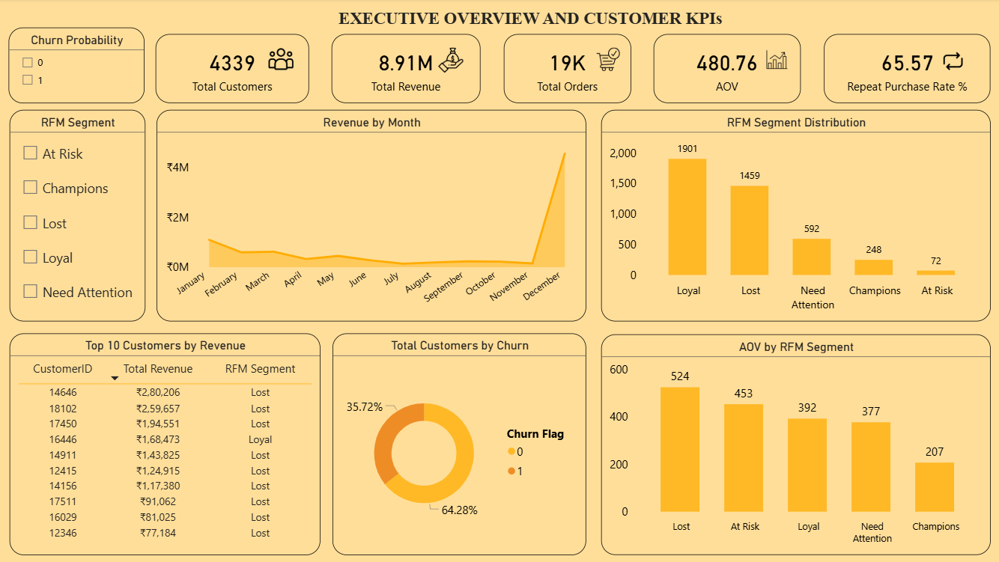
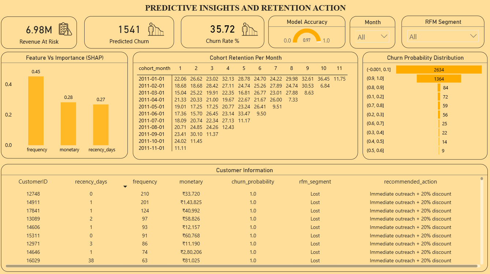

# 📊 Customer Churn & Retention Analytics

An end-to-end customer analytics project focused on identifying churn drivers, segmenting customers, predicting churn risk, and enabling data-driven retention strategies using SQL, Python, Machine Learning, and Power BI.

---

## 📌 Contents

<a href="#overview">Overview</a>

<a href="#business-problem">Business Problem</a>

<a href="#data-source">Data Source</a>

<a href="#tools--technologies">Tools & Technologies</a> 

<a href="#analytics--modeling">Analytics & Modeling</a>

<a href="#dashboard--visualization">Dashboard & Visualization</a>

<a href="#key-insights">Key Insights</a>

<a href="#business-recommendations">Business Recommendations</a>

<a href="#author--contact">Author & Contact</a>

---

## <h2>Overview</h2>

This project analyzes customer transactional data to understand purchasing behavior, identify churn patterns, and quantify revenue risk. The solution combines SQL-based analytics, customer segmentation, predictive modeling, and interactive dashboards to support retention-focused decision-making.

The final output includes a churn prediction model and a Power BI dashboard designed for business stakeholders to monitor churn risk, customer value, and retention trends.

---

## <h2>Business Problem</h2>

Customer churn leads to unstable revenue and inefficient allocation of retention efforts. Business teams often lack clear visibility into which customers are likely to churn, what behaviors drive churn, and which customer segments contribute the most revenue risk.

This project addresses these challenges by transforming raw transaction data into actionable insights through segmentation, cohort analysis, and churn prediction.

---

## <h2>Data Source</h2>

* **Online Retail Transaction Dataset**
https://www.kaggle.com/datasets/carrie1/ecommerce-data

---

## <h2>Tools & Technologies</h2>

* **SQL (MySQL)**

  * KPI calculations (AOV, churn rate, repeat purchase rate)
  * RFM segmentation and cohort retention analysis
  * Analytical views for BI consumption

* **Python**

  * Data preprocessing and feature engineering
  * Churn prediction using Random Forest
  * Model evaluation and SHAP-based feature importance

* **Power BI**

  * Interactive dashboards
  * KPI cards, segmentation visuals, cohort heatmaps
  * Churn probability and at-risk customer analysis

---

## <h2>Analytics & Modeling</h2>

The analysis includes:

* Customer-level aggregation and KPI computation
* RFM segmentation to classify customer value and risk
* Cohort analysis to evaluate retention trends over time
* Machine learning–based churn prediction using behavioral features
* Revenue-at-risk identification for high-churn-probability customers

The churn prediction model achieved strong performance with **AUC ≈ 0.99**, indicating high discrimination between churned and active customers.

---

## <h2>Dashboard & Visualization</h2>

The Power BI dashboard is structured into two pages:

**Page 1 — Customer & Revenue Overview**

* RFM segment distribution
* Revenue contribution by customer segments
* Monthly revenue trends
* Key KPI cards

**Page 2 — Churn & Retention Insights**

* Churn probability distribution
* At-risk customer identification
* Cohort retention heatmap
* Feature importance insights

 

---

## <h2>Key Insights</h2>

* Loyal customers form the largest active segment, providing stable recurring revenue.
* A significant portion of total revenue originates from customers classified as Lost or At Risk.
* Retention rates drop sharply after the first month across cohorts.
* Purchase frequency is the strongest predictor of churn risk.
* High churn probability customers represent substantial revenue exposure.

---

## <h2>Business Recommendations</h2>

* Prioritize retention campaigns for high-value at-risk customers
* Strengthen early customer engagement to reduce first-month churn
* Increase purchase frequency through targeted promotions
* Protect loyal customers with exclusive rewards
* Monitor churn probability trends to proactively manage revenue risk

---

## <h2>Author & Contact</h2>

**Prasanth Reddy Majji**  
Data Analyst  
📧 Email: majjiprasanthreddy@gmail.com  
🔗 [LinkedIn](https://www.linkedin.com/in/prasanthreddymajji/)
